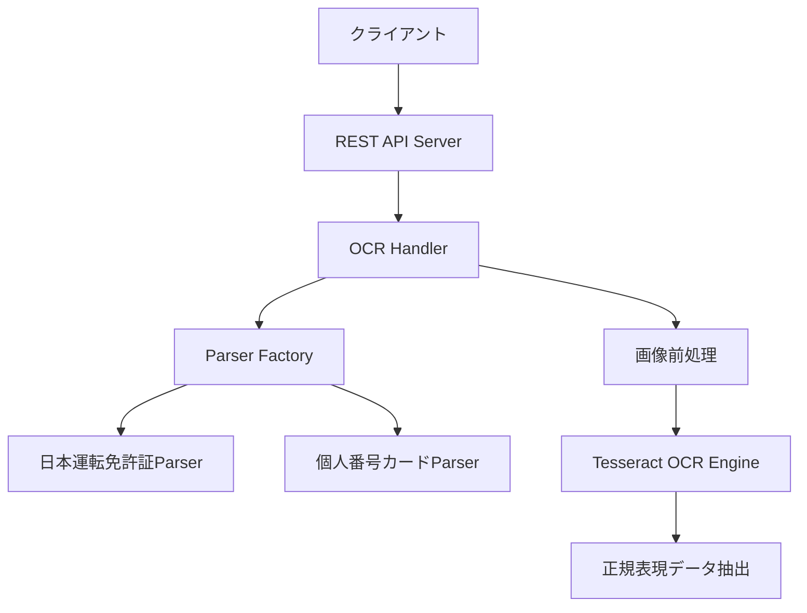

# 設計書

## 概要

OCR Web APIは、Go言語で実装されるRESTful APIサービスです。身分証明書の画像から構造化データを抽出するため、OpenCVによる画像前処理、Tesseractによる文字認識、そしてStrategyパターンによる文書タイプ別解析を組み合わせます。

## アーキテクチャ

### システム構成図



### レイヤー構成

1. **HTTPレイヤー** - リクエスト/レスポンス処理
2. **ビジネスロジックレイヤー** - OCR処理とデータ抽出
3. **データ処理レイヤー** - 画像前処理と文字認識

## コンポーネントと インターフェース

### 1. HTTPサーバー (main.go)

```go
func main() {
    http.HandleFunc("/ocr", handleOCR)
    log.Fatal(http.ListenAndServe(":8080", nil))
}
```

### 2. OCRハンドラー (handler.go)

```go
type OCRRequest struct {
    Image        string `json:"image"`
    DocumentType string `json:"documentType"`
}

type OCRResponse struct {
    DocumentType string            `json:"documentType"`
    Data         map[string]string `json:"data"`
}

func handleOCR(w http.ResponseWriter, r *http.Request)
```

### 3. DocumentParserインターフェース (parser/parser.go)

```go
type DocumentParser interface {
    Parse(mat gocv.Mat) (map[string]string, error)
}

type ParserFactory struct {
    parsers map[string]DocumentParser
}

func (pf *ParserFactory) GetParser(documentType string) (DocumentParser, error)
```

### 4. 具体的なパーサー実装

#### 日本運転免許証パーサー (parser/drivers_license_jp.go)

```go
type JPDriverLicenseParser struct {
    client *gosseract.Client
}

func (p *JPDriverLicenseParser) Parse(mat gocv.Mat) (map[string]string, error)
```

#### 個人番号カードパーサー (parser/individual_number_card.go)

```go
type IndividualNumberCardParser struct {
    client *gosseract.Client
}

func (p *IndividualNumberCardParser) Parse(mat gocv.Mat) (map[string]string, error)
```

### 5. 画像処理インターフェース (imageprocessor/interface.go)

```go
type ImageProcessor interface {
    ProcessImage(imageData []byte) (gocv.Mat, error)
    DecodeBase64(base64Data string) ([]byte, error)
}

type Processor struct {
    // 実装詳細
}
```

## データモデル

### リクエストデータ

- `image`: Base64エンコードされた画像データ（PNG、JPEG対応）
- `documentType`: 文書タイプ識別子（"drivers_license_jp", "individual_number_card_jp"）

### レスポンスデータ

- `documentType`: リクエストで指定された文書タイプ
- `data`: 抽出されたフィールドのキー・バリューマップ

### 抽出フィールド定義

#### 日本運転免許証 (drivers_license_jp)

- `name`: 氏名
- `address`: 住所
- `birth_date`: 生年月日
- `license_number`: 免許証番号
- `issue_date`: 交付年月日
- `expiry_date`: 有効期限

#### 個人番号カード (individual_number_card_jp)

- `name`: 氏名
- `address`: 住所
- `birth_date`: 生年月日
- `gender`: 性別
- `individual_number`: 個人番号
- `issue_date`: 交付年月日
- `expiry_date`: 有効期限

## エラーハンドリング

### エラータイプ定義

```go
type APIError struct {
    Code    int    `json:"code"`
    Message string `json:"message"`
}
```

### エラーケース

1. **400 Bad Request**
   - 無効なJSON形式
   - 必須フィールドの欠如
   - 無効なBase64データ

2. **422 Unprocessable Entity**
   - サポートされていない文書タイプ
   - 画像デコードエラー
   - OCR処理失敗

3. **500 Internal Server Error**
   - システム内部エラー
   - Tesseractエンジンエラー

### エラーレスポンス例

```json
{
  "error": {
    "code": 422,
    "message": "サポートされていない文書タイプです: invalid_type"
  }
}
```

## テスト戦略

### 1. 単体テスト

- 各パーサーの個別テスト
- 画像前処理機能のテスト
- エラーハンドリングのテスト

### 2. 統合テスト

- HTTPエンドポイントのテスト
- 実際の画像データを使用したE2Eテスト

### 3. テストデータ

- サンプル身分証明書画像（匿名化済み）
- 各種エラーケース用の不正データ

### 4. テスト環境

- Dockerコンテナ内でのテスト実行
- CI/CDパイプラインでの自動テスト

## 技術的詳細

### 画像前処理パイプライン

1. **Base64デコード**: `base64.StdEncoding.DecodeString()`
2. **画像読み込み**: `gocv.IMDecode()`
3. **グレースケール変換**: `gocv.CvtColor(src, &dst, gocv.ColorBGRToGray)`
4. **二値化処理**: `gocv.Threshold(gray, &binary, 0, 255, gocv.ThresholdBinaryOtsu)`

### OCR設定

```go
client := gosseract.NewClient()
defer client.Close()

// 言語設定
client.SetLanguage("jpn") // または "eng"

// OCRエンジンモード
client.SetPageSegMode(gosseract.PSM_AUTO)
```

### 正規表現パターン例

#### 日本運転免許証

```go
patterns := map[string]*regexp.Regexp{
    "name":         regexp.MustCompile(`氏名\s*([^\s]+\s+[^\s]+)`),
    "birth_date":   regexp.MustCompile(`生年月日\s*([^\s]+)`),
    "address":      regexp.MustCompile(`住所\s*([^\n]+)`),
}
```

## Docker設定

### Dockerfile構成

```dockerfile
# ビルドステージ
FROM golang:1.21.6-alpine3.19 AS builder
RUN apk add --no-cache git
WORKDIR /app
COPY go.mod go.sum ./
RUN go mod download
COPY . .
RUN go build -o ocr-api .

# 実行ステージ
FROM ubuntu:24.04
RUN apt-get update && apt-get install -y \
    tesseract-ocr \
    tesseract-ocr-jpn \
    tesseract-ocr-eng \
    libopencv-dev \
    && rm -rf /var/lib/apt/lists/*

COPY --from=builder /app/ocr-api /usr/local/bin/
EXPOSE 8080
CMD ["ocr-api"]
```

### 環境変数

- `PORT`: サーバーポート（デフォルト: 8080）
- `TESSERACT_DATA_PATH`: Tesseractデータファイルパス
- `LOG_LEVEL`: ログレベル（DEBUG, INFO, WARN, ERROR）

## パフォーマンス考慮事項

### 最適化戦略

1. **メモリ管理**: OpenCVマトリックスの適切な解放
2. **並行処理**: 複数リクエストの同時処理対応
3. **キャッシュ**: Tesseractクライアントの再利用
4. **画像サイズ制限**: 最大ファイルサイズの設定

### リソース制限

- 最大画像サイズ: 10MB
- リクエストタイムアウト: 30秒
- 同時処理数: CPU数に基づく制限